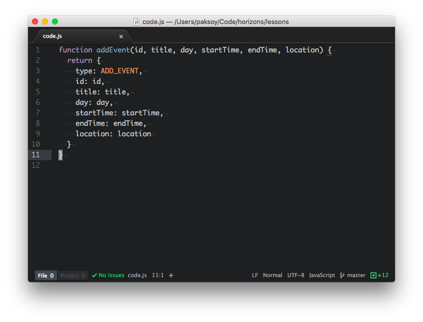
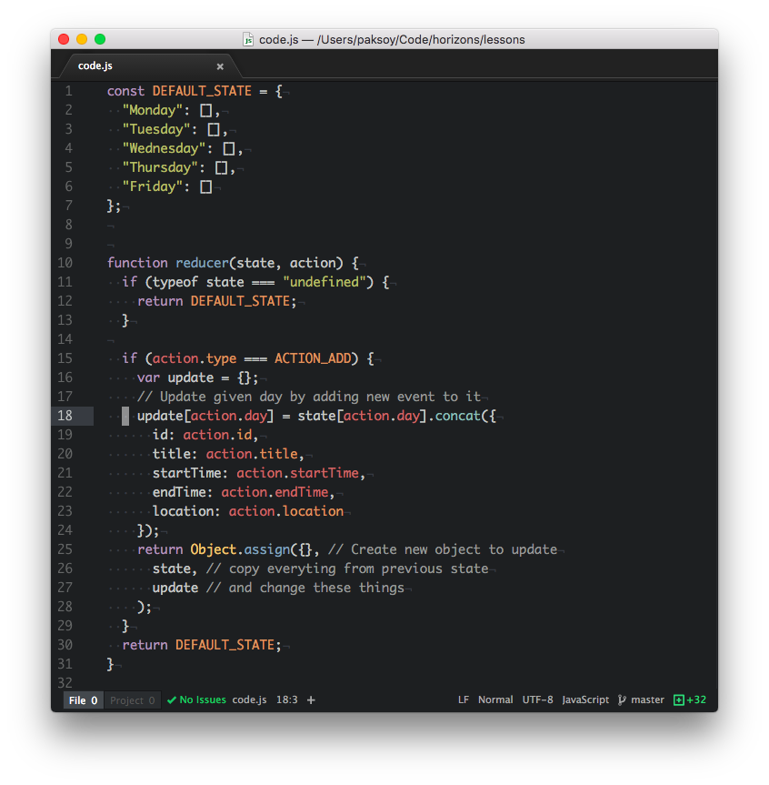
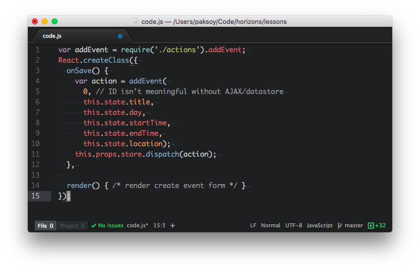
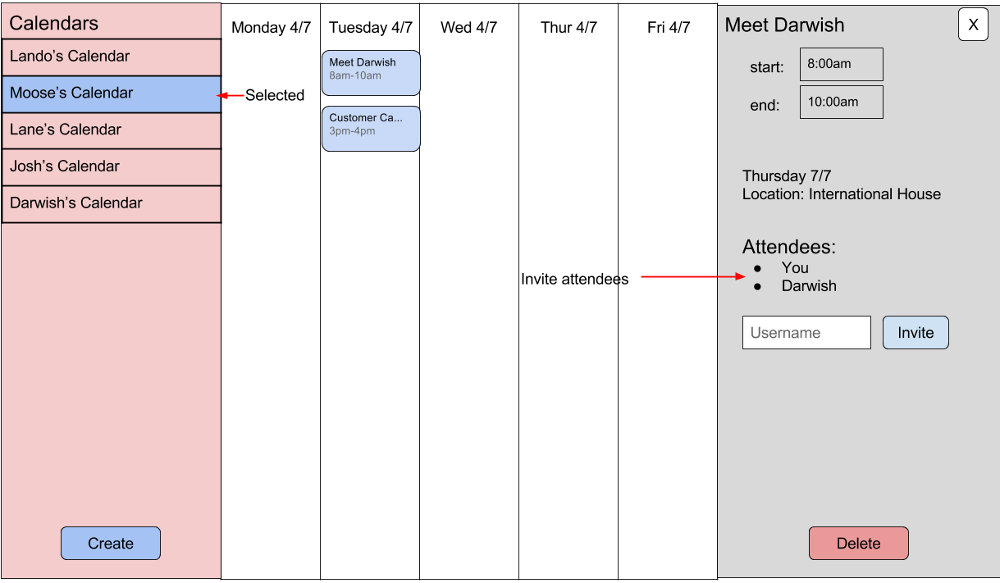

# Pair Programming Exercise: Redux Calendar

> A foreword to Windows users: please make sure you are using an LTS version of
> Node (the latest LTS release is 4.4.7). Verify that you are using the correct
> version with `node --version`.

## Goal

Your goal is to build a calendar web app, using React and Redux. Implement the
various aspects of the app as React components, and store a single application
state using Redux. Use Redux actions and reducers to update your state and
trigger React to re-render your app.

Your app should look something like this when it's done:


Your app should have the following functionality:

- Display a work week (five days) in five columns
- In each day's column, display a list of that day's events (event title and
  time)
- Clicking on the white space in any column brings up a panel on the righthand
  side that lets you create a new event on the date you clicked on
- Clicking on an existing event similarly displays the same form on the
  righthand side, allowing you to edit that event
- The start and end times, date, and location are editable. As soon as you click
  off the field, the changes are saved (i.e., there is no "Save" button!)
- The delete button allows you to delete an event
- All data is read from and written to the server using CRUD operations via a
  RESTful API

## Instructions

Work with the scaffold files in this directory. You should be familiar with this
layout by now. Make sure you're clear on which files are used on the frontend
and which are used by the backend.

- `server.js` runs your server, which serves both your REST endpoints as well as
  your frontend app via webpack
- `client/` contains the frontend React code. Note that this folder contains
  several Redux-related folders beneath it, such as `actions/`, `components/`,
  and `reducers/`.
- `models/` contains your database models (for the backend)
- `routes/api.js` contains the REST API endpoints. These have been partially
  filled in for you.

Fire up your server now and make sure everything is working. Note that you'll
need to pass in a couple of environment variables such as `SECRET` and
`MONGODB_URI` as in previous projects. The scaffold includes a complete Redux
flow: if you click on the button, an action is triggered which updates the
store, and then the app is re-rendered with the updated data.

## Step 1. Static frontend

Let's start simple. Don't worry about Redux, the database, or the backend yet for this first
step. Just get your components to render properly, letting you create, edit, and delete
events. This will just happen in memory, so that when you reload the page, the
data will be cleared--you'll fix this later when you plug it into the backend via AJAX.

Spend some time thinking about the right component hierarchy for your app. This
is important for two reasons: to get the visual layout (the view) right, and to
get the data flow right. Now that you're familiar with React, you should be
comfortable with the idea of looking at an existing app, a mockup, or a spec,
and immediately forming a mental model of what the component hierarchy might
look like. The fantastic article [Thinking in
React](https://facebook.github.io/react/docs/thinking-in-react.html) contains
lots more information and advice on how to do this.

For now let's keep things simple and just display one arbitrary week with days
labeled "Monday" to "Friday." Later we'll make this piece more dynamic.

For this application, you probably want two top-level components inside your
`<App>`: a calendar on the left side, and an edit/create panel on the right
side. The calendar component should be further broken down into a list of five
day components, each of which contains zero or more event components. You may
choose to render the edit/create panel on the right side as a single component,
or you may choose to break it down further, creating e.g. title, start/end time,
location etc. components. So your overall component hierarchy should look
something like this:

```
<App>
  <Calendar>
    <Day></Day>
    <Day>
      <Event/>
      <Event/>
    </Day>
    <Day></Day>
    <Day></Day>
  </Calendar>
  <EditPanel/>
</App>
```

Your components also do not need to pass or receive props yet, but you should
start thinking about how data will be passed around. For instance, when you
click on a day on the Calendar to create a new event, how does the EditPanel
know which day you clicked on?

At the end of this step, you should have an app that _looks_ like the mockup
above but doesn't _do_ anything yet, since we haven't added the data flow or the
backend yet.

## Step 2. Interactive Mockup

Let's flex those Redux muscles. Now that your view components are in place,
let's begin tying them together by adding a data flow using Redux.

### State

The first step to using Redux is to design the overall shape of your app's
state. This is critical because it will dictate how your reducer works. See
[Reducers](http://redux.js.org/docs/basics/Reducers.html) for more advice on how
to do this effectively.

#### Events

At the core of any calendar are Events. We will represent each event using an object with the fields

- `title`: String, event title
- `location`: String, event location
- `startTime`: Number, event start time as [milliseconds since January 1st, 1970 (like `Date.now()`)][datenow]
- `endTime`: Number, event end time as [milliseconds since January 1st, 1970 (like `Date.now()`)][datenow]

[datenow]: https://developer.mozilla.org/en-US/docs/Web/JavaScript/Reference/Global_Objects/Date/now

Example:

```javascript
// Event
{
	title: 'Meet Darwish',
	location: 'International House',
	startTime: 1467903035659,
	endTime: 1467906671034
}
```

#### Days

Then we have Days. Each **Day** can have multiple **Events**. The
Events in the Day are ordered by their start time, so we
use arrays to represent them.

Example:

```javascript
// Day has 2 events
[
{
	title: 'Meet Darwish',
	location: 'International House',
	startTime: 1467903035659,
	endTime: 1467906671034
},
{
	title: 'Customer Call',
	location: 'Starbucks',
	startTime: 1467914274502,
	endTime: 1467917890199
}
]
```

#### Week: Bringing it together

We group **Days** into a **Week** using a JavaScript Object. Keys in this
object will be days of week (i.e. Monday, Tuesday, Wednesday and so on) and
values will be the **Day** array we described before.


Example:

```javascript
{
	// Monday has 2 events
	"Monday": [
		{
			title: 'Meet Darwish',
			location: 'International House',
			startTime: 1467903035659,
			endTime: 1467906671034
		},
		{
			title: 'Customer Call',
			location: 'Starbucks',
			startTime: 1467914274502,
			endTime: 1467917890199
		}
	],
	// Tuesday through Thursday have 0 events
	"Tuesday": [],
	"Wednesday": [],
	"Thursday": [],
	// Day 5 has 1 event
	"Friday": [
		{
			title: 'Lunch',
			location: 'Wishbone',
			startTime: 1468252940513,
			endTime: 1468256540513
		}
	]
}
```

## Implement "Add Event"

### "Add Event" Action

First we will implement the "Add Event" action.

Recall that an **action** in Redux is a single, granular, specific piece of
information that changes the app's state. It should contain the _minimum amount
of data to get the job done._ Actions are simple JavaScript Objects that always
have a `type`, and may optionally contain additional data. See the example code
in `client/actions/index.js`.

The file `client/actions/index.js` contains a set of functions which are _action
creators:_ they take a piece of data, such as an event title, and return an
action with a type and some data.

Let's define our first action and action creator function in
`client/actions/index.js`. Call it `createEvent`. It should take the information
necessary to create an event--a title, a day, a start time, an end time, and
optionally a location--and it should return an event that, when dispatched into
the store, will create the event for us in the store.

First we need a new action type:

```javascript
const ADD_EVENT = 'ADD_EVENT';
```

(The contents of the `ADD_EVENT` variable here don't matter very much, but we
use strings because they're convenient and serializable.)

Next create the `addEvent()` function that returns an
action object:



Make sure you add this new function to `module.exports`
so it's available in other files.

### "Add Event" Reducer

Let's write a reducer that handles the `ADD_EVENT` action. It's a function that
takes two arguments, state and an action, and it returns an updated state, so we
know that it looks something like this:

```javascript
function reducer(state, action) {
  ...
  return state;
}
```

Recall that the reducer is a _pure function_. It takes the current state and an action, and returns an
updated state. But **it does not mutate the current state** and **has
no side effects.** These properties are critical for a bunch of reasons:

- They make our code simple, easy to understand, predictable, and beautiful, in
  a sexy computer sciencey sort of way
- They allow Redux to apply all sorts of optimizations to make our apps run fast
  and smooth like Ethan's hair
- They make it easy to do awesome stuff such as testing, undo/redo, and hot
  reloading


From our discussion of `State` above, we know what the shape of our state Object
should look like, which is the only other piece of information that we need to
build our reducer. Take a moment to review that state shape now and commit it to
memory because it will be critical for what follows.

Naively it may seem that we want to do something like this:

❌ **Don't do this** ❌

```javascript
function reducer(state, action) {
  state[action.day].push({ /* new event */ });
  return state;
}
```

However, this would result in a big, fat, honking, greasy error about mutating
our existing state. Is it clear why? It's been said before, but it bears
repeating: **reducers are pure functions and must not modify the state.**

When we add an event, we want to _create and return a new copy of the state._ We have to update the **Week** object
with `Object.assign()` and the **Day** array with
`Array.concat()`. (See **Changing without mutating below**.)

One last important requirement for a reducer: when called without a state, it
must return a default, starting state. (This is because Redux calls our reducer
once in the beginning without a previous state.)


**Try doing this on your own before glancing at the code that follows.**



#### Changing without mutating

We can use the
[`Object.assign` builtin](https://developer.mozilla.org/en-US/docs/Web/JavaScript/Reference/Global_Objects/Object/assign) to update Objects without mutating.
[`Array.slice`](https://developer.mozilla.org/en-US/docs/Web/JavaScript/Reference/Global_Objects/Array/slice) (note: no relation to `Array.splice`! Don't confuse the two!) and [`Array.concat`](https://developer.mozilla.org/en-US/docs/Web/JavaScript/Reference/Global_Objects/Array/concat) are similarly useful with Arrays.


<sub>**Example of creating and returning a new object with `Object.assign`**</sub>
```javascript
var obj = {a: 1};
var obj2 = {b: 2};
var obj3 = {c: 3};

var newObj = Object.assign({}, obj, obj2, obj3);
// newObj -> {a: 1, b: 2, c: 3}
```
```javascript
var obj = {a: 1, b: 2};
var obj2 = {a: 2, c: 2};
var obj3 = {a: 3, b: 1};

var newObj = Object.assign({}, obj, obj2, obj3);
// newObj -> {a: 3: b: 1, c: 2}

// See how objects have an order of precedence in Object.assign?
// Both obj2 and obj3 had property "a" defined, but obj3's value
// for "a" was used in the resulting newObj because obj3 comes after
// obj2!
```

<sub>**Example of creating and returning a new array with `Array.concat`**</sub>

```javascript
var arr = [1, 2, 3];
var arr2 = [4, 5, 6];
var arr3 = [7, 8];

var newArr = [].concat(arr, arr2, arr3);
// newArr -> [1, 2, 3, 4, 5, 6, 7, 8] - in order!
```

<sub>**Example of inserting into the middle of a new array with `Array.slice` and `Array.concat`**</sub>

```javascript
// We want to insert "orange" between "apple" and "banana"
var arr = ["apple", "banana"]

var newArr = [].concat(arr.slice(0, 1), "orange", arr.slice(1));
// Note that calling .slice() without a second parameter
// for a non-inclusive end index uses the array's length
// for the end index

```

### "Add Event" in React

Redux state is available to your `App` component
under `this.props.store`. Pass it down to all your child components with
`<ChildComponent store={this.props.store} />` so that it's available
everywhere.

React files:

- `client/components/app.js`: `App` component definition
- `client/index.js`: root render function where `App` component is initialized

The final step to moving your app's data flow entirely into Redux is to tie the
state and actions into your React components.  What about actions? We defined these inside `client/actions/index.js`, so we can
include these anywhere we need them.

You will need a UI component like a button to trigger
creating a new event. This button (or link, or whatever you choose) should have an `onClick` handler triggers
the `addEvent()` action we have defined before.

For instance, if you have a component that
creates a new event, it may trigger an action like this:



Once you're done, you should be able to create and
view any number of events in your application.
If you refresh your page, though, they will disappear
because we have not connected them to the server yet.

## Implementing Other Actions

Fill in the other actions that you created above. Much like Express.js apps and
routes, Redux allows us to modularly combine different reducers into a single
reducer, if our reducer starts growing unwieldy. Keep things simple for now and
stick with a single reducer. If you want to learn more about this or try your
hand at combining reducers, [read about it here](http://redux.js.org/docs/basics/Reducers.html).


For this app, you'll want a set of actions corresponding to user events such
as updating events and deleting events. With your knowledge of Redux actions, it is up to you to implement these functions yourself:

- **Updating an event**: users should be able to make changes to events
  - You will need a new property in your Redux store called `selectedEvent`, which will be an object that represents a single event with all of its details. 
    - This property should get updated during the `onClick` of each of your `<Event />` components.
    - The input values of your `<EditPanel />` should be rendered with the correct information from your state, based on `selectedEvent`, since you've subscribed to Redux state changes from the `<App />` level.
  - In addition, you will need two new actions to modify your `selectedEvent` property in your state: `SELECT_EVENT` and `UNSELECT_EVENT`. When an `<Event />` component is clicked, dispatch a `SELECT_EVENT` action, and when `<EditPanel />` is closed, dispatch an `UNSELECT_EVENT` action to remove it from the store.
- **Deleting an event**: users should be able to remove pre-existing events

At the end of this step, your app should work locally, i.e. without reading data
from or writing data to the server. If you seeded your app with sample data, it
should appear and you should be able to edit it, as well as to create new events
and delete existing events.

## Step 3. REST endpoints

Let's switch to the backend code for a bit.

Take a look at `routes/api.js`. The first route has been filled in for you, and
the others have been stubbed for you. Finish filling these out, to tie your
CRUD endpoints to the data in the database:

- `POST /event`: Called when the user creates an event. Should return the id of
  the newly-created event. The AJAX call below should use this id to create a
  new event on the screen and link it to the data model with the id.
- `PUT /event/:eid`: Called when the user edits an event, passing an event ID,
  `eid`. Should return the updated event object.
- `GET /event`: Called when the app first loads or the user refreshes the data.
  Should return all event objects.
- `GET /event/:eid`: Called to fetch the details for a specific event. Should
  return a single event object. (Depending how you manage event data in the
  client, you may not need this endpoint as you already have a full list of
  events from the previous endpoint.)
- `DELETE /event/:eid`: Called when the user deletes an event. Should return the
  deleted event object.

At the end of this step, you should have a fully-functional backend RESTful API
that lets you create, read, update, and delete events--but it's not tied to the
frontend yet. That comes next!

## Step 4. AJAX

With your backend routes in place, let's switch back to the frontend and tie it
all together. When a user creates a new event, the event should be sent to the
backend via an AJAX call. When the AJAX call completes successfully, the app's
data model should be updated (a Redux action should be dispatched).

We'll leave this part mostly up to you, but here's a hint. You can use `$.ajax`
inside your React components to fire off AJAX requests to work with the event
objects. For instance, the `onSave()` event above might be modified like this:

```javascript
var addEvent = require('./actions').addEvent;
var $ = require('jquery');
React.createClass({
  onSave: function() {
    $.ajax({
      url: '/api/event',
      method: 'POST',
      data: this.state,
      success: function (data) {
        var action = addEvent(
          data.id, // The ID of the newly-created object in the database.
          this.state.title,
          this.state.day,
          this.state.startTime,
          this.state.endTime,
          this.state.location);
        this.props.store.dispatch(action);
      }
    });
  },
});
```

Think carefully about how to handle errors here.

For now, don't worry about making your actions asynchronous too. Keep it simple:
just update the app's data model when the AJAX call completes. Improving this is
a bonus exercise.

At the end of this step you've got a fully-functional calendar app that is
completely tied to a backend database and data model via a RESTFUL CRUD API.
Pretty cool right?

## Step 5. Multiple users <sup style="color: red">new!</sup>

Let's now support multiple users in your app. You should add:

- A new panel on the left side to view existing users and create new
  users
- A section to your `<EditEvent />` component for displaying attendees for
  a particular event and inviting new attendees.



Don't worry about logins and passwords for this exercise. We will let anyone
create new users, view and edit their events.

What matters is making changes to your application state so that

### New components for multiple users

As before, first create new component with static HTML to get your display
issues sorted out.

You should have a new component `<Users />` that lives inside the
`<App />` component. So your app component should now contain three things:

```
<App>
  <Users />
  <Calendar />
  <EditEvent />
</App>
```

Add an attendees list and an inline form for inviting attendees to your
`<EditEvent />` component.

If there are multiple attendees for an `<Event />`, it should show up
on all the calendars for all the attendees.

### New state for multiple users

Each user in our app will be represented by an object with two properties:

- `id`: unique id of the user
- `name`: name of the user

We need to track two new things in our top level state in
`client/reducers/index.js`

- `users`: an array of all users. This array is displayed inside the `<Users />`
  panel.

  ```javascript
  users: [
    {id: 1, name: "Lando"},
    {id: 2, name: "Moose"},
    {id: 3, name: "Lane"},
    {id: 4, name: "Josh"},
    {id: 5, name: "Darwish"}
  ]

  ```

- `activeUser`: The active user. This is used to filter the `<Calendar />`
  to only show events belonging to the current user.

  ```javascript
  activeUser: {id:2, name: "Moose"}
  ```

Finally we're going to add a new field to our Event object to represent
attendees:

- `attendees`: an array of users who are attending the current
  event

  ```javascript
  ...
  location: "International House",
  attendees: [
    {id: 2, name: "Moose"},
    {id: 5, name: "Darwish"}
  ]
  ```

### New actions for multiple users

Update `client/reducers/index.js` and `client/actions/index.js` to add
the following new actions:

- **Add user:** concat a new user to top-level `users` array. This should update
  the `<Users />` component to display the new user.
- **Switch user:** replace `activeUser`. This should update the `<Users />`
  component to highlight the newly active user.
- **Invite user:** concat a new user to the `attendees` array inside event.
  This should update the `<Event />` view with the new attendees. It should
  also update the calendar view for the attendee so this event shows up
  in both calendars.

## Step 6. Changing weeks

Right now your calendar is fixed on a single, arbitrary, platonic
"Monday-Friday" week. That's not how real calendars work, of course. In this
final step, you're going to make your calendar even more dynamic by allowing the
user to scroll through different weeks. You're on your own to design and build
this part, but here's some guidance to get you started.

First of all, the view. You may find the [Bootstrap date
picker](https://eonasdan.github.io/bootstrap-datetimepicker/) form element
useful here. Or you may choose to use another date picker library. Or you may
choose to build your own. Instead of a date picker, you could have simple arrows
to allow the user to go forward or backward in time by a week. Choose your own
journey. You'll also need to decide where to put this in the UI, and how to
allow the user to switch weeks. We recommend ignoring weekends entirely and just
sticking to weekdays now to keep things simple. Spend some time looking at
existing calendar apps (Apple Calendar, Google Calendar, Sunrise, etc.) to see
how they solve this problem for inspiration.

Next, the data flow. You'll need to add some state representing the
currently-selected week. This will make your reducer slightly more complicated.
You might consider splitting your reducer into multiple functions, one to handle
date changes and the other to handle events, and then recombining them again
into the required single reducer function
(see [Reducers](http://redux.js.org/docs/basics/Reducers.html)).

Consider how to tie your new date-picker controls into your data flow: they
should be able to read the currently-selected date (or week) from the state, and
act upon it by dispatching a `DATE_CHANGE` (or `WEEK_CHANGE`) action. That
action should cause the state to update, which should cause your calendar to be
re-rendered on the new dates.

Finally, be careful how you tie your event data to a particular day in the
calendar. This might need tweaking, too.

## Step 7. Display events properly (Bonus)

Right now all events are just stacked at the top of the date column for each
date. That's also not how real calendars work. Try making them appear where they
should throughout the day, and changing their size depending upon the length of
the event.

You'll need to add a column somewhere showing the times throughout the
day--again, compare existing calendar apps for inspiration. You'll also need to
change how your view logic renders events. Fortunately this change shouldn't
require updating the data model, since you already have all of the data you
need.

Another problem you'll have to tackle: what to do with overlapping events. By
the way, this part is pretty hard. Different calendar apps do different things
to solve this. Feel free to choose a reasonable, simple solution.

## More Bonuses

- Add robust [asynchronous
  actions](http://redux.js.org/docs/advanced/AsyncActions.html) for all of the
  AJAX calls
- Allow Google Calendar-style click-and-drag to create a new event in a
  particular timeslot
- Add support for accounts and multiple users, using passport
- Allow the user to view other user's calendars (read only)
- Allow the user to invite other users to their events
- Import a user's calendar data from Facebook or Google
- Try _writing_ the data back to Facebook or Google

## Suggested reading

- https://facebook.github.io/react/docs/thinking-in-react.html
- https://quickleft.com/blog/redux-plain-english-workflow/
- https://medium.com/swlh/the-case-for-flux-379b7d1982c6
- http://redux.js.org/docs/introduction/ThreePrinciples.html
- https://egghead.io/lessons/javascript-redux-the-single-immutable-state-tree
- https://www.youtube.com/watch?v=1w-oQ-i1XB8
